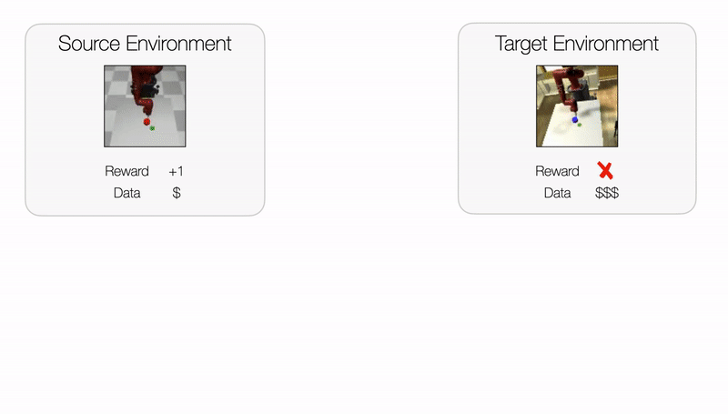

# Policy Transfer across Visual and Dynamics Domain Gaps via Iterative Grounding

[Grace Zhang](), [Linghan Zhong](https://thoughtp0lice.github.io/), [Youngwoon Lee](https://youngwoon.github.io), [Joseph J. Lim](https://clvrai.com) at [USC CLVR lab](https://clvrai.com)<br/>
[[Project website]()] [[Paper]()]

This project is a PyTorch implementation of [Policy Transfer across Visual and Dynamics Domain Gaps via Iterative Grounding](), which is published in RSS 2021.

<p align="center">
    
</p>

The ability to transfer a policy from one environment to another is a promising avenue for efficient robot learning in realistic settings where task supervision is not available. To succeed, such policy transfer must overcome both the **visual** and **dynamics** domain gap between source and target environments. We propose IDAPT, a novel policy transfer method with iterative environment grounding that alternates between (1) directly minimizing both visual and dynamics domain gaps by grounding the source environment in the target environment, and (2) training a policy on the grounded source environment. The empirical results on locomotion and robotic manipulation tasks demonstrate that our method can effectively transfer a policy across large domain gaps with minimal interaction with the target environment.


## Prerequisites

* Ubuntu 18.04 or above
* Python 3.6 or above
* Mujoco 2.0


## Directories

* `run.py`: sets up experiment and runs training
* `training/`: our method and baseline implementations
    * See domain randomization configuration instructions [here](docs/dr_config_instructions.md).
* `config/`: hyper-parameters
* `environments/`: registers environments used for the paper (SawyerPush, FetchReach)


## Installation

0. Clone this repo.

   ```bash
   git clone https://github.com/clvrai/idapt.git
   ```

1. Install python dependencies.

   ```bash
   pip install -r requirements.txt
   ```

2. Set the environment variable for headless rendering.

   ```bash
   export PYOPENGL_PLATFORM="EGL"
   ```

3. Download demonstration files with task names (e.g. InvertedPendulum, HalfCheetah, Walker2d, FetchReach, SawyerPush).

   ```bash
   python download_data.py [TASK_NAME]
   # example: python download_demos.py Walker2d SawyerPush
   ```

### Unity app installation

Adding `--unity True` to the command  will automatically download the Unity app.
For headless servers, virtual display needs to be executed (e.g., `sudo /usr/bin/X :1`) and specify the virtual display id (e.g.  `--virtual_display :1`)
In macOS, if the app does not launch due to the not verified developer, go to the directory `./binary`, right-click `Furniture.app`, and click `Open` once. Then, the app can be launched by our environment without error.


## Example Commands

### InvertedPendulum

- Train ours

  ```bash
  python -m run --source_env=InvertedPendulum-v2 --target_env=GymInvertedPendulumDM-v0
  ```

- Train DR-Narrow

  ```bash
  python -m run --source_env=GymInvertedPendulumDM-v2 --target_env=GymInvertedPendulumDM-v0 --dr=True --dr_params_set=IP_min
  ```

- Train DR-Wide

  ```bash
  python -m run --source_env=GymInvertedPendulumDM-v2 --target_env=GymInvertedPendulumDM-v0 --dr=True --dr_params_set=IP_max
  ```

### HalfCheetah

- Train ours

  ```bash
  python -m run --source_env=HalfCheetah-v3 --target_env=GymHalfCheetahDM-v0 --data=backwards
  ```

- Train DR-Narrow

  ```bash
  python -m run --source_env=HalfCheetah-v3 --target_env=GymHalfCheetahDM-v0 --dr=True --dr_params_set=HC_min
  ```

- Train DR-Wide

  ```bash
  python -m run --source_env=HalfCheetah-v3 --target_env=GymHalfCheetahDM-v0 --dr=True --dr_params_set=HC_max
  ```

### Walker2D

- Train ours

  ```bash
  python -m run --source_env=GymWalker-v0 --target_env=GymWalkerDM-v0 --data=backwards
  ```

- Train DR-Narrow

  ```bash
  python -m run --source_env=GymWalker-v0 --target_env=GymWalkerDM-v0 --dr=True --dr_params_set=WK_min
  ```

- Train DR-Wide

  ```bash
  python -m run --source_env=GymWalker-v0 --target_env=GymWalkerDM-v0 --dr=True --dr_params_set=WK_max
  ```

### Fetch Reach

- Train ours

  ```bash
  python -m run --source_env=FetchReach-v1 --target_env=GymFetchReach-v0 --unity=True --action_rotation_degrees=45 --action_z_bias=-0.5
  ```

- Train DR-Narrow

  ```bash
  python -m run --source_env=FetchReach-v1 --target_env=GymFetchReach-v0 --dr=True --dr_params_set=FR_min --action_rotation_degrees=45 --action_z_bias=-0.5
  ```

- Train DR-Wide

  ```bash
  python -m run --source_env=FetchReach-v1 --target_env=GymFetchReach-v0 --dr=True --dr_params_set=FR_max --action_rotation_degrees=45 --action_z_bias=-0.5
  ```

### Sawyer Push

- Train ours

  ```bash
  python -m run --source_env=SawyerPushZoom-v0 --target_env=SawyerPushShiftViewZoomBackground-v0 --unity=True --target_env_puck_friction=2.0 --target_env_puck_mass=0.05
  ```

- Train DR-Narrow

  ```bash
  python -m run --source_env=SawyerPushZoom-v0 --target_env=SawyerPushShiftViewZoomBackground-v0 --dr=True --dr_params_set=FR_min --action_rotation_degrees=45 --action_z_bias=-0.5
  ```

- Train DR-Wide

  ```bash
  python -m run --source_env=SawyerPushZoom-v0 --target_env=SawyerPushShiftViewZoomBackground-v0 --dr=True --dr_params_set=FR_max --action_rotation_degrees=45 --action_z_bias=-0.5
  ```

<!---
### Modifying parameters

- set mod_env_params to true
- set param_mod_instructions to a list of instructions
  - each instruction should be {elem_type}.{name}.{attribute}.{value}[.extra_args]
    - elem_type is the type of element in the environment xml to be changed
    - name is the name of the element to be changed, when name is default the dummy element under default is changed
    - attribute just the attribute to change
    - value is the target value to set to
    - extra_args
      - When setting friction, an extra arg "friction_type={type}" need to be set. If no extra arg is added, the default friction type is sliding
- examples
  - Instruction to set mass of leg_geom to 20: geom.leg_geom.mass.20
  - Instruction to set sliding friction of leg_geom to 20 geom.leg_geom.friction.20.friction_type=sliding

--->

## Citation
```
@inproceedings{zhang2021policy,
  title={Policy Transfer across Visual and Dynamics Domain Gaps via Iterative Grounding},
  author={Grace Zhang and Linghan Zhong and Youngwoon Lee and Joseph J. Lim},
  booktitle={Robotics: Science and Systems},
  year={2021},
}
```


## References
- PyTorch implementation of Dynamics Cycle-Consistency paper: https://github.com/sjtuzq/Cycle_Dynamics
- Sawyer MuJoCo environment: https://github.com/StanfordVL/robosuite
- Sawyer assets: https://github.com/vikashplus/sawyer_sim
- Domain randomization: https://github.com/matwilso/domrand
- Unity-MuJoCo interface: https://github.com/clvrai/furniture
