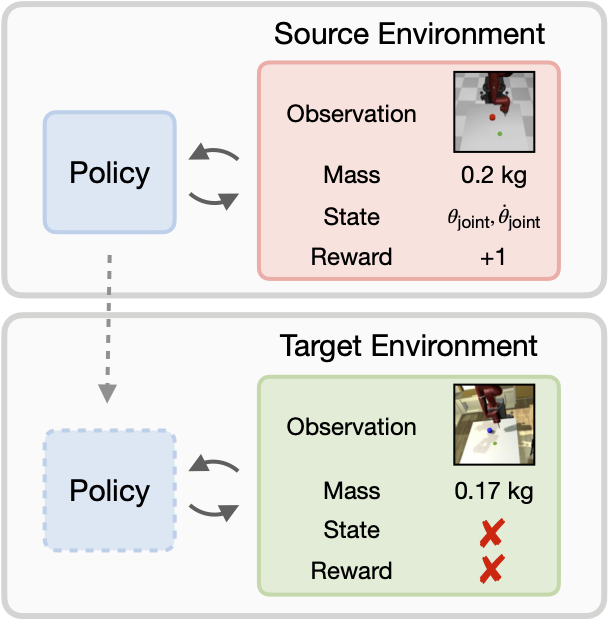
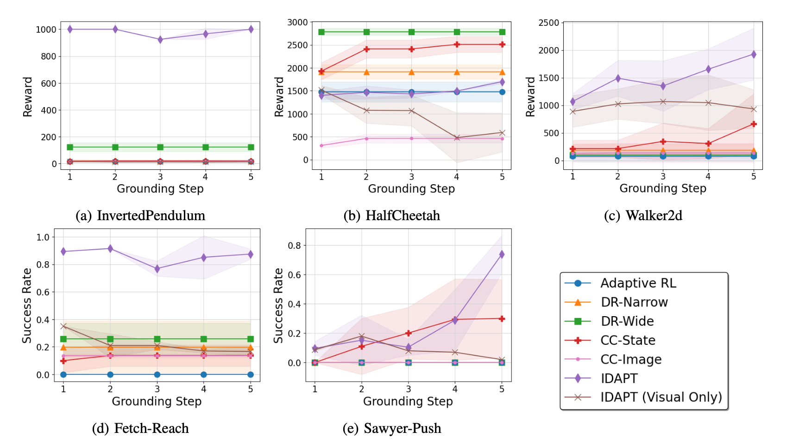
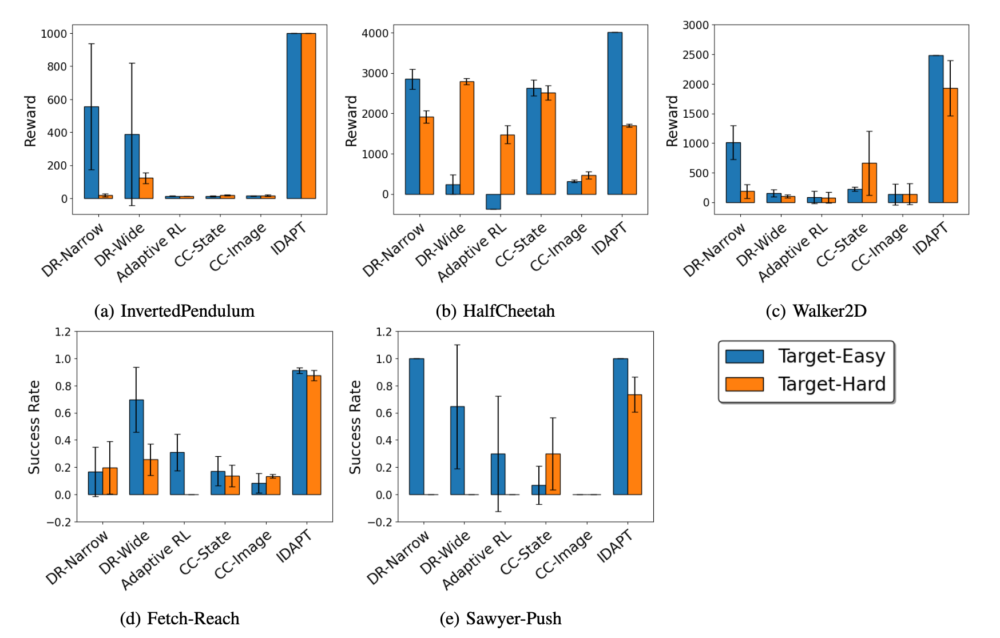

----
## Motivation
Training a physical robot directly in a home or office is impractical due to the cost of data collection and a lack of training supervision.  Instead, policy transfer can allow us to take advantage of source environments well suited for training, such as a simulation or laboratory, to learn a policy for the target environment.  However, RL policies trained in one environment tend to perform poorly in the other due to the visual domain gap (e.g. lighting, viewpoint, clutter, and background) and dynamics domain gap (e.g. the mass of objects and calibration of the robot).  While prior work focuses on addressing only one type of domain gap at a time, our work tackles both visual and dynamics domain gaps simultaneously.

----

## IDAPT - Iterative Domain Alignment for Policy Transfer

We propose to transfer a policy to the target environment by minimizing both visual and dynamics domain gaps. The key goal is to learn a grounded source environment that mimics the target domains so that a policy trained in this grounded environment can then be executed successfully in the target environment.  We iterate between source environment grounding and policy training to gradually improve the alignment between the grounded and target environments and the performance of the policy.


---

## Qualitative Results

We use five different locomotion and manipulation tasks and transfer a policy from the source environment to  two target environments, Target-Easy and Target-Hard, with increasing visual and dynamics domain gap sizes.  The following videos show the task in the source environment and IDAPT's performance in the target environments.  In all tasks and target environments, IDAPT is able to transfer a reasonable policy to the target environment that closely resembles the behavior in the source environment.

<br>


<div class="w3-row-padding">
    <div class="w3-col s1 w3-center"></div>
    <div class="w3-col s10 w3-center">
        <video height="auto" width="100%" controls autoplay loop muted>
            <source src="./img/source.mp4" type="video/mp4">
        </video>
        <video height="auto" width="100%" controls autoplay loop muted>
            <source src="./img/idapt_target_easy.mp4" type="video/mp4">
        </video>
        <video height="auto" width="100%" controls autoplay loop muted>
            <source src="./img/idapt_target_hard.mp4" type="video/mp4">
        </video>
        <p></p>
    </div>
    <div class="w3-col s1 w3-center"></div>
</div>

<br>

For each Target-Hard environment, we compare the performance of IDAPT at the first and last training iterations.  We also compare with domain randomization with narrow (DR-Narrow) and wide (DR-Wide) randomization ranges, Adaptive RL baseline, and a domain adaptation method, CC (Zhang et al. 2021), which learns state-to-visual observation mapping and action mapping from data.  IDAPT is able to transfer a policy consistently while most other methods fail completely in at least one task.  In many tasks, IDAPT shows significant improvement over iterations.  For example, in SawyerPush, IDAPT pushes the puck past in the goal after the first training iteration but is able to complete the task successfully in the last iteration.


<br>


<div class="w3-row-padding">
    <div class="w3-col s1 w3-center"></div>
    <div class="w3-col s10 w3-center">
        <video height="auto" width="100%" controls autoplay loop muted>
            <source src="./img/target_hard_videos.mp4" type="video/mp4">
        </video>
        <p></p>
    </div>
    <div class="w3-col s1 w3-center"></div>
</div>

----

## Quantitative Results

In the Target-Hard environments, IDAPT outperforms baselines methods in all tasks except HalfCheetah and in many environments, demonstrates improvement over multiple grounding steps.



IDAPT consistently performs well over multiple tasks and is able to scale to larger domain gaps.  While domain randomization baselines perform well in Target-Easy environments, they are generally unable to scale this performance to the Target-Hard environments.



----

## Citation
```
@inproceedings{zhang2021policy,
  title={Policy Transfer across Visual and Dynamics Domain Gaps via Iterative Grounding},
  author={Grace Zhang and Linghan Zhong and Youngwoon Lee and Joseph J. Lim},
  booktitle={Proceedings of Robotics: Science and Systems},
  year={2021},
  address={Virtual},
  month={July},
  DOI={10.15607/RSS.2021.XVII.006}
}
```
